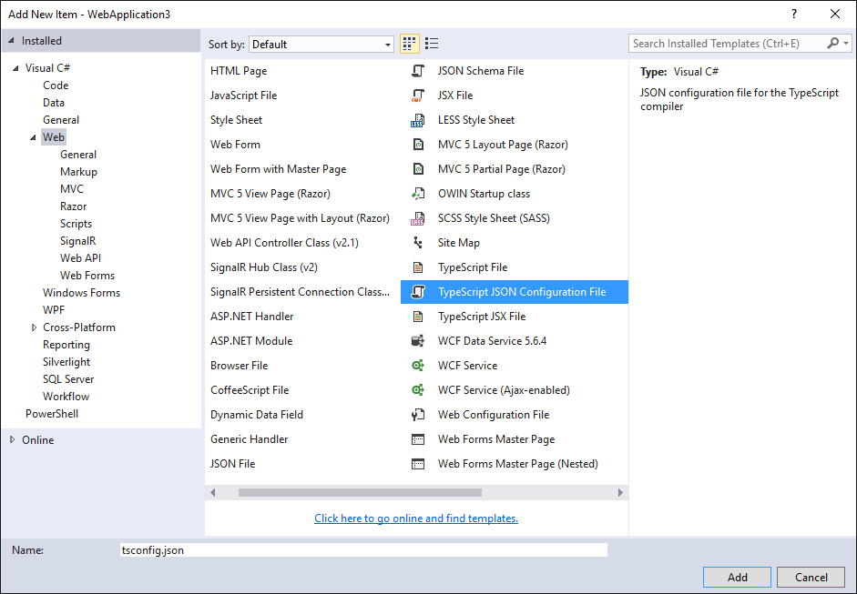

# ASP.NET Core

## 安装 ASP.NET Core 和 TypeScript

首先，若有必要请[安装 ASP.NET Core](https://get.asp.net)。
这个快速上手指南使用的是 Visual Studio ，若要使用 ASP.NET Core 你需要有 Visual Studio 2015。

其次，如果你的 Visual Studio 中没有包含 TypeScript，你可以从这里安装[TypeScript for Visual Studio 2015](http://www.microsoft.com/en-us/download/details.aspx?id=48593)。

## 新建工程

1. 选择 **File**
2. 选择 **New Project** （Ctrl + Shift + N）
3. 选择 **Visual C#**
4. 选择 **ASP.NET Web Application**

   

5. 选择 **ASP.NET 5 Empty** 工程模板

   取消复选 "Host in the cloud" 本指南将使用一个本地示例。
   

运行此应用以确保它能正常工作。

## 设置服务项

在 `project.json` 文件的 `"dependencies"` 字段里添加:

```json
"Microsoft.AspNet.StaticFiles": "1.0.0-rc1-final"
```

最终的 dependencies 部分应该类似于下面这样：

```json
"dependencies": {
  "Microsoft.AspNet.IISPlatformHandler": "1.0.0-rc1-final",
  "Microsoft.AspNet.Server.Kestrel": "1.0.0-rc1-final",
  "Microsoft.AspNet.StaticFiles": "1.0.0-rc1-final"
},
```

用以下内容替换 `Startup.cs` 文件里的 `Configure` 函数：

```cs
public void Configure(IApplicationBuilder app)
{
    app.UseIISPlatformHandler();
    app.UseDefaultFiles();
    app.UseStaticFiles();
}
```

# 添加 TypeScript

下一步我们为 TypeScript 添加一个文件夹。


将文件夹命名为 `scripts`。


## 添加 TypeScript 代码

在`scripts`上右击并选择**New Item**。
接着选择**TypeScript File**（也可能 .NET Core 部分），并将此文件命名为`app.ts`。


## 添加示例代码

将以下代码写入app.ts文件。

```ts
function sayHello() {
  const compiler = (document.getElementById("compiler") as HTMLInputElement).value;
  const framework = (document.getElementById("framework") as HTMLInputElement).value;
  return `Hello from ${compiler} and ${framework}!`;
}
```

## 构建设置

### 配置 TypeScript 编译器

我们先来告诉TypeScript怎样构建。
右击scripts文件夹并选择**New Item**。
接着选择**TypeScript Configuration File**，保持文件的默认名字为`tsconfig.json`。



将默认的`tsconfig.json`内容改为如下所示：

```json
{
  "compilerOptions": {
    "noImplicitAny": true,
    "noEmitOnError": true,
    "sourceMap": true,
    "target": "es5",
  },
  "files": [
    "./app.ts"
  ],
  "compileOnSave": true
}
```

看起来和默认的设置差不多，但注意以下不同之处：

1. 设置`"noImplicitAny": true`。
2. 显式列出了`"files"`而不是依据`"excludes"`。
3. 设置`"compileOnSave": true`。

当你写新代码时，设置`"noImplicitAny"`选项是个不错的选择 &mdash; 这可以确保你不会错写任何新的类型。
设置`"compileOnSave"`选项可以确保你在运行web程序前自动编译保存变更后的代码。

### 配置 NPM

现在，我们来配置NPM以使用我们能够下载JavaScript包。
在工程上右击并选择**New Item**。
接着选择**NPM Configuration File**，保持文件的默认名字为`package.json`。
在`"devDependencies"`部分添加"gulp"和"del"：

```json
"devDependencies": {
  "gulp": "3.9.0",
  "del": "2.2.0"
}
```

保存这个文件后，Visual Studio将开始安装gulp和del。
若没有自动开始，请右击package.json文件选择**Restore Packages**。

### 设置 gulp

最后，添加一个新JavaScript文件`gulpfile.js`。
键入以下内容：

```js
/// <binding AfterBuild='default' Clean='clean' />
/*
This file is the main entry point for defining Gulp tasks and using Gulp plugins.
Click here to learn more. http://go.microsoft.com/fwlink/?LinkId=518007
*/

var gulp = require('gulp');
var del = require('del');

var paths = {
  scripts: ['scripts/**/*.js', 'scripts/**/*.ts', 'scripts/**/*.map'],
};

gulp.task('clean', function () {
  return del(['wwwroot/scripts/**/*']);
});

gulp.task('default', function () {
  gulp.src(paths.scripts).pipe(gulp.dest('wwwroot/scripts'))
});
```

第一行是告诉Visual Studio构建完成后，立即运行'default'任务。
当你应答 Visual Studio 清除构建内容后，它也将运行'clean'任务。

现在，右击`gulpfile.js`并选择**Task Runner Explorer**。
若'default'和'clean'任务没有显示输出内容的话，请刷新explorer：


## 编写HTML页

在`wwwroot`中添加一个新建项 `index.html`。
在`index.html`中写入以下代码：

```html
<!DOCTYPE html>
<html>
<head>
    <meta charset="utf-8" />
    <script src="scripts/app.js"></script>
    <title></title>
</head>
<body>
    <div id="message"></div>
    <div>
        Compiler: <input id="compiler" value="TypeScript" onkeyup="document.getElementById('message').innerText = sayHello()" /><br />
        Framework: <input id="framework" value="ASP.NET" onkeyup="document.getElementById('message').innerText = sayHello()" />
    </div>
</body>
</html>
```

## 测试

1. 运行项目。
2. 在输入框中键入时，您应该看到一个消息：


## 调试

1. 在 Edge 浏览器中，按 F12 键并选择 **Debugger** 标签页。
2. 展开 localhost 列表，选择 scripts/app.ts
3. 在 `return` 那一行上打一个断点。
4. 在输入框中键入一些内容，确认TypeScript代码命中断点，观察它是否能正确地工作。


这就是你需要知道的在ASP.NET中使用TypeScript的基本知识了。接下来，我们引入Angular，写一个简单的Angular程序示例。

# 添加 Angular 2

## 使用 NPM 下载所需的包

在 `package.json` 文件的 `"dependencies"` 添加 Angular 2 和 SystemJS：

```json
  "dependencies": {
    "angular2": "2.0.0-beta.11",
    "systemjs": "0.19.24",
  },
```

## 安装 typings

Angular 2 包含 es6-shim 以提供 Promise 支持，但 TypeScript 还需要它的类型文件。
打开一个 command prompt，切换到应用程序源文件目录中：

```shell
cd C:\Users\<you>\Documents\Visual Studio 2015\Projects\<app>\src\<app>
npm install -g typings
typings install es6-shim --ambient
```

## 更新 tsconfig.json

现在安装好了 Angular 2 及其依赖项，我们还需要启用 TypeScript 中实验性的装饰器支持并且引入 es6-shim 的类型文件。
将来的版本中，装饰器和 ES6 选项将成为默认选项，我们就可以不做此设置了。添加
`"experimentalDecorators": true, "emitDecoratorMetadata": true` 选项到 `"compilerOptions"` 选项段，添加 `"./typings/main.d.ts"` 到 `"files"` 选项段。
最后，我们还将要创建新的代码文件 `"./src/model.ts"`、`"./src/main.ts"` ，也将它们添加到 `"files"` 中，现在 tsconfig 看起来像这样：

```json
{
  "compilerOptions": {
      "noImplicitAny": true,
      "noEmitOnError": true,
      "sourceMap": true,
      "experimentalDecorators": true,
      "emitDecoratorMetadata": true,
      "target": "es5"
  },
  "files": [
      "./app.ts",
      "./model.ts",
      "./main.ts",
      "../typings/main.d.ts"
  ],
  "compileOnSave": true
}
```

## 将 Angular 添加到 gulp 构建中

最后，我们需要确保 Angular 文件作为 build 的一部分复制进来。
我们需要添加：

1. 库文件目录。
2. 添加一个 `lib` 任务来输送文件到 `wwwroot`。
3. 在 `default` 任务上添加 `lib` 任务依赖。

更新后的 `gulpfile.js` 像如下所示：

```xml
/// <binding AfterBuild='default' Clean='clean' />
/*
This file is the main entry point for defining Gulp tasks and using Gulp plugins.
Click here to learn more. http://go.microsoft.com/fwlink/?LinkId=518007
*/

var gulp = require('gulp');
var del = require('del');

var paths = {
    scripts: ['scripts/**/*.js', 'scripts/**/*.ts', 'scripts/**/*.map'],
    libs: ['node_modules/angular2/bundles/angular2.js',
           'node_modules/angular2/bundles/angular2-polyfills.js',
           'node_modules/systemjs/dist/system.src.js',
           'node_modules/rxjs/bundles/Rx.js']
};

gulp.task('lib', function () {
    gulp.src(paths.libs).pipe(gulp.dest('wwwroot/scripts/lib'))
});

gulp.task('clean', function () {
    return del(['wwwroot/scripts/**/*']);
});

gulp.task('default', ['lib'], function () {
    gulp.src(paths.scripts).pipe(gulp.dest('wwwroot/scripts'))
});
```

此外，保存了此gulpfile后，要确保 Task Runner Explorer 能看到 `lib` 任务。

## 用 TypeScript 写一个简单的 Angular 应用

首先，将 `app.ts` 改成：

```ts
import {Component} from "angular2/core"
import {MyModel} from "./model"

@Component({
    selector: `my-app`,
    template: `<div>Hello from {{getCompiler()}}</div>`
})
class MyApp {
    model = new MyModel();
    getCompiler() {
        return this.model.compiler;
    }
}
```

接着在 `scripts` 中添加 TypeScript 文件 `model.ts`:

```ts
export class MyModel {
    compiler = "TypeScript";
}
```

再在 `scripts` 中添加 `main.ts`：

```ts
import {bootstrap} from "angular2/platform/browser";
import {MyApp} from "./app";
bootstrap(MyApp);
```

最后，将 `index.html` 改成：

```html
<!DOCTYPE html>
<html>
<head>
    <meta charset="utf-8" />
    <script src="scripts/lib/angular2-polyfills.js"></script>
    <script src="scripts/lib/system.src.js"></script>
    <script src="scripts/lib/rx.js"></script>
    <script src="scripts/lib/angular2.js"></script>
    <script>
    System.config({
        packages: {
            'scripts': {
                format: 'cjs',
                defaultExtension: 'js'
            }
        }
    });
    System.import('scripts/main').then(null, console.error.bind(console));
    </script>
    <title></title>
</head>
<body>
    <my-app>Loading...</my-app>
</body>
</html>
```

这里加载了此应用。
运行 ASP.NET 应用，你应该能看到一个 div 显示 "Loading..." 紧接着更新成显示 "Hello from TypeScript"。
